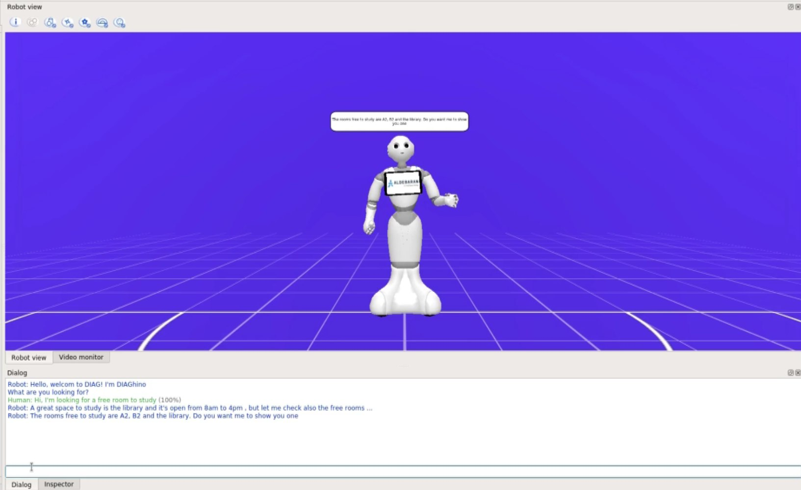
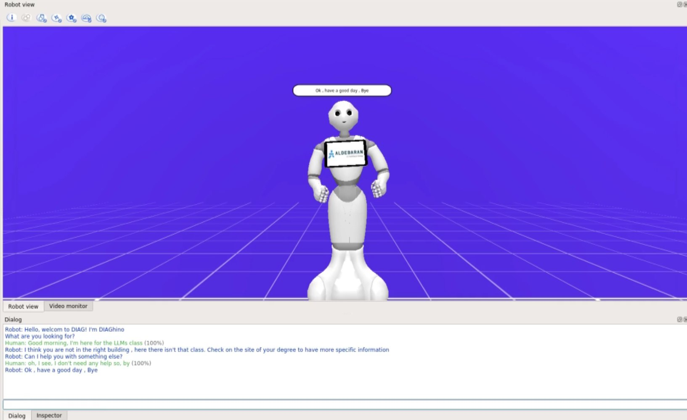
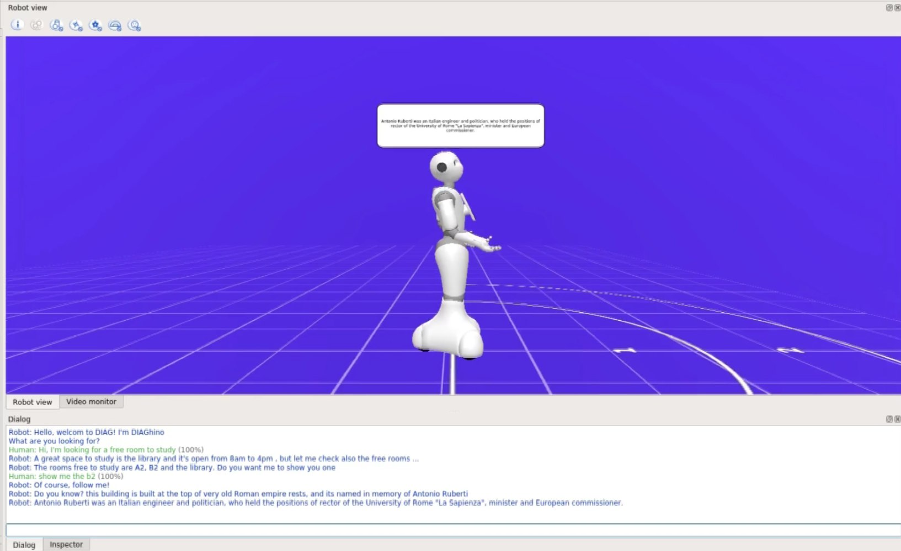

# Pepper: HRI + RA project
This repository contains video demos and the implementation of the project for Human-Robot Interaction and Reasoning Agents developed in Choregraphe.
 
The code for Pepper is located inside the 'Pepper_dialog1' folder. To run it, you only need to open it with Choregraphe. 
 
Instead, the 'planner_lectures.py' file shows the Planner implemented in the project using Breadth First Search (BFS), and it can be run with Python3
 
If you just want to see the final results you can go to "Video" folder, or read the report "RA_HRI_report.pdf".
 
 

## Project Videos
#### Ask for free rooms to study

#### Asking a class not scheduled

#### Pepper walking explaining the building

